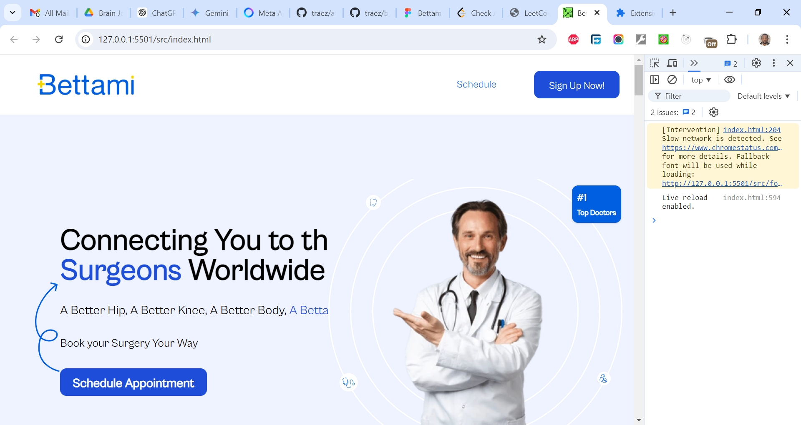

# Bettami Figma Conversion Xuaib

This is a Figma to HTML/Tailwind CSS conversion gig I got. Design is available [here](https://www.figma.com/design/PRwypfiFUh8gHWbPHL2u96/Bettami). I believe "Practice makes Perfect", so keep building I must.

## Table of contents

- [Overview](#overview)
  - [The challenge](#the-challenge)
  - [Screenshot](#screenshot)
  - [Links](#links)
  - [My process](#my-process)
  - [Built with](#built-with)
  - [What I learned](#what-i-learned)
  - [Continued development](#continued-development)
  - [Useful resources](#useful-resources)
  - [Author](#author)
  - [Acknowledgments](#acknowledgments)

## Overview

### The Challenge/User Stories

- Translate Figma UI components to HTML and Tailwind CSS accurately.
- Ensure responsive design matches Figma specifications.
- Achieve pixel-perfect alignment across devices.
- Maintain consistent styling as per the design system.
- Integrate exported assets into the HTML and Tailwind CSS codebase efficiently.
- Implement specified interactions and animations.
- Ensure accessibility standards compliance.
- Test for cross-browser compatibility.
- Provide comprehensive documentation for handoff.

### Screenshot

### Links

- Solution URL: [https://github.com/traez/bettami-figma-conversion-xuaib](https://github.com/traez/bettami-figma-conversion-xuaib)
- Live Site URL: [https://bettami-figma-conversion-xuaib-trae-zeeofors-projects.vercel.app](https://bettami-figma-conversion-xuaib-trae-zeeofors-projects.vercel.app/)

## My process

### Built with

- Semantic HTML5 markup
- CSS custom properties
- Flexbox and CSS Grid
- Mobile-first workflow
- [React](https://reactjs.org/) - JS library**  
- [Next.js](https://nextjs.org/) - React framework**  
- Tailwind CSS
- Typescript**  
- Nodejs (with/without Expressjs)
- MongoDB** 

### What I learned

- **Bookmarks VS Code Extension:**  
Use the Bookmarks VS Code extension by Alessandro Fragnani to easily navigate between very lengthy tabs.
- **Tailwind CSS Mobile Targeting:**  
Build with a mobile-first breakpoint mindset.  
Use un-prefixed utilities to target mobile and override them at larger breakpoints.  
- **Group and Group-Hover Classes in Tailwind CSS:**  
Utilize group and group-hover classes to style child elements based on the hover state of a parent element.
These can be used alongside breakpoints and the hidden class to control element visibility based on window size, without needing JavaScript.
- **Absolute and Relative Positioning Refresher:**  
Refreshed my knowledge of absolute and relative positioning to enhance layout control.
- **Figma AI for Property Confirmation:**  
Use Figma AI to confirm properties, but do the logic yourself.
- **Vanilla CSS Scrolling:**  
Implement horizontal/Vertical scrolling with vanilla CSS/Tailwind to make cards scroll one view per horizontal scroll.
- **Tailwind Installation via CLI:**  
Install Tailwind using the CLI for a better experience than the non-production possible Play CDN installation type.
- **Custom Fonts in Tailwind:**  
Add custom downloaded fonts to Tailwind for enhanced typography control.
- **Cropping PNGs:**  
Use [https://onlinepngtools.com/crop-png](https://onlinepngtools.com/crop-png) to crop .png images without distorting the background color.
- **Awesome Screen Recorder & Screenshot:**  
Utilize the Awesome Screen Recorder & Screenshot tool for recording project reviews.

### Continued development

- More projects; increased competence!

### Useful resources

Stackoverflow  
YouTube  
Google  
ChatGPT

## Author

- Website - [Trae Zeeofor](https://github.com/traez)
- Twitter - [@trae_z](https://twitter.com/trae_z)

## Acknowledgments

-Jehovah that keeps breath in my lungs
